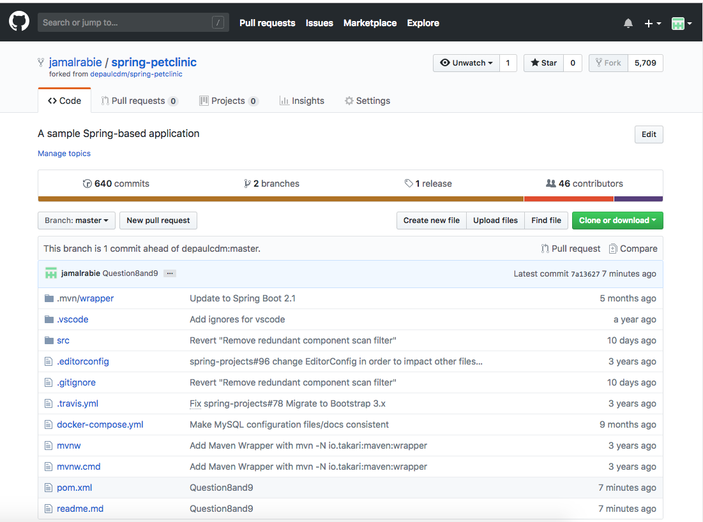

Your Github account showing that is has been forked from the depaulcdm/spring-petclinic repository.

Your Travis CI dashboard showing a successful  rst build.
The section of the POM  le showing the coordinates after you’ve changed them.
Your Travis CI dashboard showing a successful build after your change of the group ID.
The section of the POM  le showing the coordinates after you’ve commented them out.
Your Travis CI dashboard showing the unsuccessful build after the breaking change.
Your Github repository with the readme.md  le selected showing the build failed status after the Travis CI build fails.
The section of the POM  le showing the coordinates after you’ve  xed them.
Your Travis CI dashboard showing the successful build after the breaking change has been  xed.
Your Github repository with the readme.md  le selected showing the build success status after the Travis CI build has recovered.

